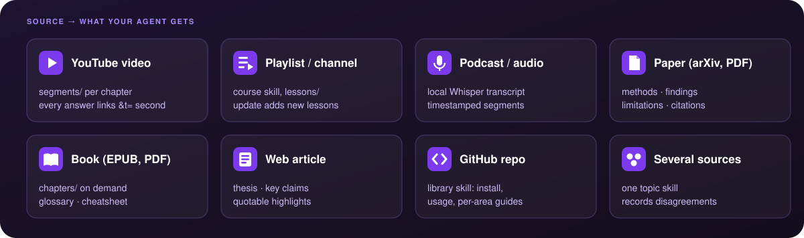
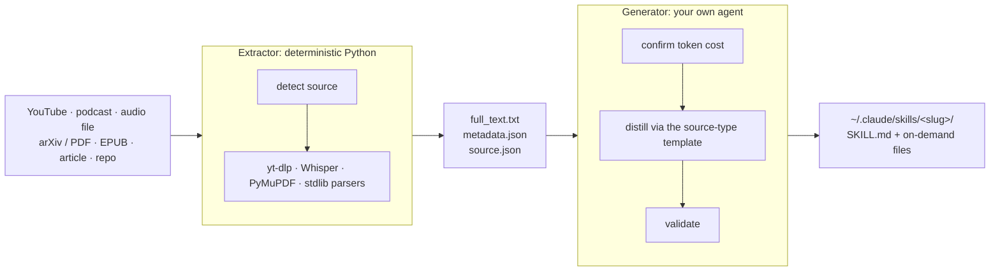

<div align="center">


# source-to-skill

**Turn YouTube videos, podcasts, papers, books, articles, and GitHub repos into AI agent skills.**<br>
One command in Claude Code, GitHub Copilot CLI, Amp, or any [Agent Skills](https://github.com/agentskills/agentskills) host. Local Whisper, no API keys.

[](https://github.com/michalstrnadel/source-to-skill/actions/workflows/ci.yml)
[](pyproject.toml)
[](LICENSE)
[](#quick-start)
[](https://github.com/michalstrnadel/source-to-skill/stargazers)

[Quick start](#quick-start) · [Examples](#examples-gallery) · [Sources](#supported-sources) · [How it works](#how-it-works) · [FAQ](#faq) · [Website](https://michalstrnadel.github.io/source-to-skill/)


</div>

You watched the two-hour lecture, listened to the podcast, skimmed the paper. A week later your coding agent knows none of it, and pasting the transcript costs the full token bill on every question.

**source-to-skill** distills any of these into a structured [agent skill](https://github.com/agentskills/agentskills): a short `SKILL.md` your agent loads on demand, plus support files it reads only when a question needs them. Answers cite the source, and for video and audio they link back to the exact second (`&t=842s`).

```
/source-to-skill https://www.youtube.com/watch?v=zjkBMFhNj_g
```

```
intro-to-large-language-models/
├── SKILL.md                         # core ideas + timestamped segment index (1.5k tokens)
├── segments/
│   ├── 01-intro-and-llm-inference.md  # one file per chapter, loaded only when needed,
│   ├── 02-llm-training.md             #   each opening with its &t= deep link
│   └── ...
├── cheatsheet.md                    # numbers, mental models, decision rules
└── source.json                      # lets `/source-to-skill update` refresh it later
```

## Quick start

**Claude Code plugin** (recommended):

```
/plugin marketplace add michalstrnadel/source-to-skill
/plugin install source-to-skill@source-to-skill
```

**Any agent, via [uv](https://docs.astral.sh/uv/):**

```bash
uvx --from git+https://github.com/michalstrnadel/source-to-skill source-to-skill install                   # -> ~/.claude/skills/
uvx --from git+https://github.com/michalstrnadel/source-to-skill source-to-skill install --agent copilot   # -> ~/.copilot/skills/ (or: agents)
```

Once the package is on PyPI this shortens to `uvx source-to-skill install`.

**Manual:** `git clone` this repo and symlink `skills/source-to-skill/` into your agent's skills folder ([details](#install-for-other-agents)).

Then install the extractors for the sources you use, and ask:

```bash
pip install yt-dlp PyMuPDF        # YouTube + PDFs; EPUB, articles and repos need nothing
pip install mlx-whisper           # podcasts & captionless videos (Apple Silicon)
pip install faster-whisper        #   ... or this one anywhere else
```

```
/source-to-skill https://www.youtube.com/watch?v=...      # 1. extract, see the token estimate, pick where to install
/intro-to-large-language-models what is the LLM OS?       # 2. ask - answers cite and deep-link the source
```

## Supported sources



| Source | Example | What your agent gets |
|--------|---------|----------------------|
| **YouTube video** | `/source-to-skill https://youtube.com/watch?v=...` | chapter-segmented skill; every answer deep-links the exact `&t=` second |
| **YouTube playlist** | `/source-to-skill https://youtube.com/playlist?list=...` | course skill: lesson index, one linked lesson per video, course cheatsheet |
| **YouTube channel** | `/source-to-skill https://youtube.com/@3blue1brown` | the channel's latest 20 videos (`--limit N`) as one skill |
| **Podcast / audio** | `/source-to-skill https://podcasts.apple.com/...?i=...` | local Whisper transcript, chapters or 10-min segments, `[hh:mm:ss]` citations |
| **Any video site** | `/source-to-skill https://vimeo.com/... --type audio` | anything [yt-dlp](https://github.com/yt-dlp/yt-dlp) can download (1,000+ sites), transcribed locally |
| **Local recording** | `/source-to-skill ~/Downloads/all-hands.mp4` | meetings, lectures, voice memos: `.mp3 .m4a .wav .mp4 .mov .webm ...` |
| **Academic paper** | `/source-to-skill https://arxiv.org/abs/1706.03762` | TL;DR, key claims with evidence, methods, findings, limitations, glossary, citations |
| **Book** | `/source-to-skill book.epub` (PDF: `--type book`) | mental models, chapter index with on-demand chapter files, glossary, cheatsheet |
| **Web article** | `/source-to-skill https://example.com/post` | byline, thesis, key claims linked to the original, quotable highlights |
| **GitHub repo** | `/source-to-skill https://github.com/pallets/flask` | library skill from README + docs (Markdown, MDX, reStructuredText): install, usage, guides, cheatsheet |
| **Several at once** | `/source-to-skill <paper> <video> <article>` | one topic skill, ideas tagged by source, plus `disagreements.md` |

Videos without captions are transcribed with Whisper automatically when a backend is installed (`--transcribe` forces it).

## Examples gallery

Every skill in [`examples/`](examples/) was generated by this tool from the linked source. Browse them to see the output quality before installing, or copy one into your skills folder and start asking.

<!-- gallery:start -->
| Skill | Source | Type | Source tokens | `SKILL.md` | Whole skill |
|-------|--------|------|-------:|-----------:|------------:|
| [intro-to-large-language-models](examples/intro-to-large-language-models/) | Andrej Karpathy, [*[1hr Talk] Intro to Large Language Models*](https://www.youtube.com/watch?v=zjkBMFhNj_g) | video | 16.4k | 1.5k | 7.8k |
| [neural-networks-3blue1brown](examples/neural-networks-3blue1brown/) | 3Blue1Brown, [*Neural networks*](https://www.youtube.com/playlist?list=PLZHQObOWTQDNU6R1_67000Dx_ZCJB-3pi) (10 videos) | course | 52.6k | 1.8k | 11.7k |
| [attention-is-all-you-need](examples/attention-is-all-you-need/) | Vaswani et al., [arXiv 1706.03762](https://arxiv.org/abs/1706.03762) | paper | 8.1k | 1.1k | 7.2k |
| [pro-git](examples/pro-git/) | Chacon & Straub, [*Pro Git*](https://git-scm.com/book) (CC BY-NC-SA 3.0) | book | 186.5k | 1.7k | 51.2k |
| [building-effective-agents](examples/building-effective-agents/) | Anthropic, [*Building effective agents*](https://www.anthropic.com/engineering/building-effective-agents) | article | 3.7k | 2.0k | 2.4k |
| [flask](examples/flask/) | [`pallets/flask`](https://github.com/pallets/flask) README + 77 docs pages | repo | 78.9k | 1.6k | 16.7k |
| [how-transformers-work](examples/how-transformers-work/) | the paper above + [3Blue1Brown video](https://www.youtube.com/watch?v=eMlx5fFNoYc) + Jay Alammar's [*Illustrated Transformer*](https://jalammar.github.io/illustrated-transformer/) | topic | 20.3k | 1.2k | 8.5k |
<!-- gallery:end -->

Token counts are estimates (words × 1.33). The agent loads only `SKILL.md` when the skill is relevant, then opens a segment, chapter, or guide when a question needs it. Asking about *Pro Git* costs about 1.7k tokens plus one chapter, not 186k.

## Why a skill?

| | Paste the transcript | RAG pipeline | NotebookLM | **source-to-skill** |
|---|:---:|:---:|:---:|:---:|
| Lives inside your coding agent | yes | with work | no | **yes** |
| Cost per question | full source, every time | retrieved chunks | n/a | **~4k-token index + files it needs** |
| Structure (frameworks, decision rules, numbers) | no | no | partial | **yes** |
| Deep links to the exact second | no | no | no | **yes** |
| Infrastructure (vector DB, embeddings, API keys) | none | yes | cloud account | **none** |
| Runs locally, sources stay on your machine | yes | depends | no | **yes** (your agent's model aside) |
| Works across Claude Code, Copilot CLI, Amp | n/a | custom | no | **yes** (open standard) |

Documentation-site scrapers such as [Skill_Seekers](https://github.com/yusufkaraaslan/Skill_Seekers) turn API docs into skills. source-to-skill focuses on what you **watch, listen to, and read**: talks, courses, podcasts, papers, books, essays.

## How it works



The work is split in two halves. A **deterministic extractor** (Python, standard library plus optional `yt-dlp`, `PyMuPDF`, and Whisper) normalizes every source into the same text-plus-metadata contract. **Your own agent** then distills that contract through the template for the source type, following the skill's [`SKILL.md`](skills/source-to-skill/SKILL.md). Nothing calls a cloud API: transcription runs on your machine, and generation uses whatever model your agent already runs. Details in [docs/ARCHITECTURE.md](docs/ARCHITECTURE.md).

Generated skills hold **structure, not summaries**: frameworks, decision rules, anti-patterns, and concrete numbers, front-loaded into a `SKILL.md` capped at about 4k tokens. `tools/validate_skill.py` checks every run: frontmatter, links that resolve, no empty files.

## Power features

**Topic skills from several sources.** Pass several sources and get one skill. Every idea is tagged with the sources behind it (`[S1]`, `[S2]`), and `disagreements.md` records where they contradict each other or use different numbers or definitions. Disagreements are kept side by side, never averaged into one claim. See [how-transformers-work](examples/how-transformers-work/).

```
/source-to-skill https://arxiv.org/abs/1706.03762 https://youtu.be/eMlx5fFNoYc https://jalammar.github.io/illustrated-transformer/ how-transformers-work
```

**Skills that stay fresh.** Every skill keeps a `source.json`. When the playlist or channel publishes new videos:

```
/source-to-skill update ~/.claude/skills/neural-networks-3blue1brown
```

The tool re-extracts the source, diffs it against the manifest, and generates only the new lessons.

**Podcasts and recordings, fully local.** Whisper runs on your machine through [mlx-whisper](https://github.com/ml-explore/mlx-examples/tree/main/whisper) on Apple Silicon (`whisper-large-v3-turbo` by default) or [faster-whisper](https://github.com/SYSTRAN/faster-whisper) elsewhere. To trade accuracy for speed or disk space, set `SOURCE_TO_SKILL_WHISPER_MODEL=mlx-community/whisper-small-mlx` (or a faster-whisper size such as `base`).

## Extractor reference

The skill drives this for you. It also works standalone (`source-to-skill extract ...` from the CLI, or `python3 skills/source-to-skill/scripts/extract.py ...`):

```
extract.py <source> [--type youtube|playlist|audio|paper|book|article|repo]
                    [--limit N] [--transcribe] [--work-dir PATH]
extract.py --check
```

| Flag | Effect |
|------|--------|
| `--type` | override detection: `book` for a PDF book, `playlist` for a `watch?v=...&list=...` URL, `audio` for any page with a video or audio track |
| `--limit N` | only the first N videos of a playlist (channels default to the latest 20) |
| `--transcribe` | Whisper even when captions exist (useful for poor auto-captions) |
| `--work-dir` | output directory for `full_text.txt`, `metadata.json`, `source.json` |
| `--check` | report installed extractors, Whisper backend and model, ffmpeg, and a stale yt-dlp |

## Requirements

- Python 3.10 or newer
- Optional, install only what you use:
  - `yt-dlp` for YouTube videos, playlists, and channels, and for podcast downloads
  - `PyMuPDF` for PDF papers and books
  - `mlx-whisper` (Apple Silicon) or `faster-whisper` for podcasts, audio files, and captionless videos; `mlx-whisper` also needs `ffmpeg`
- EPUB books, web articles, and GitHub repos need only the standard library
- `pip install "source-to-skill[all] @ git+https://github.com/michalstrnadel/source-to-skill"` installs the CLI with every extractor for your platform

## Install for other agents

`skills/source-to-skill/` is self-contained (SKILL.md, extractor scripts, validator). Install it with the CLI (`source-to-skill install --agent <claude|agents|copilot> [--project]`, see [Quick start](#quick-start)), or symlink or copy it into the folder your agent reads:

```
~/.claude/skills/    # Claude Code
~/.copilot/skills/   # GitHub Copilot CLI
~/.agents/skills/    # Amp / cross-agent
```

Project-local `.claude/skills/`, `.agents/skills/`, or `.github/skills/` work too. A symlink picks up `git pull` updates; a copy stays on the version you copied.

## FAQ

<details>
<summary><b>How do I turn a YouTube video into a Claude skill?</b></summary>

Install the plugin, then run `/source-to-skill <youtube-url>` in Claude Code. The extractor pulls the captions with yt-dlp (or transcribes the audio when there are none), splits them along the video's chapters, and your agent writes a skill whose answers link to the exact timestamp.
</details>

<details>
<summary><b>Can Claude Code learn from a podcast?</b></summary>

Yes. Pass an Apple Podcasts episode link, a direct `.mp3` URL, or a downloaded file. With `mlx-whisper` or `faster-whisper` installed, the episode is transcribed on your machine and becomes a skill with `[hh:mm:ss]` citations. Spotify episodes are DRM-protected and not supported.
</details>

<details>
<summary><b>Is this a NotebookLM alternative for Claude Code?</b></summary>

For learning sources, mostly yes: you get grounded answers about your videos, papers, and books, inside the agent you already code with, as plain files you own. NotebookLM is a hosted notebook. source-to-skill produces portable skills that work in Claude Code, Copilot CLI, Amp, and any Agent Skills host.
</details>

<details>
<summary><b>How do I make an agent skill from a PDF or a book?</b></summary>

`/source-to-skill paper.pdf` treats a PDF as an academic paper (methods, findings, limitations). For a book, use `/source-to-skill book.epub`, or add `--type book` for a PDF book, which takes chapters from the PDF outline.
</details>

<details>
<summary><b>How much does it cost?</b></summary>

The tool is free and MIT-licensed. Generation reads the source once through your agent; the skill shows the token estimate and asks before it starts. After that, each question loads a SKILL.md of at most about 4k tokens plus only the files it needs.
</details>

<details>
<summary><b>Does it need an API key or send my files anywhere?</b></summary>

No. Extraction and transcription run locally. The only model involved is the one your agent already uses.
</details>

<details>
<summary><b>What is an agent skill?</b></summary>

A folder with a `SKILL.md` (a name, a description, and instructions) plus optional files, defined by the open [Agent Skills](https://github.com/agentskills/agentskills) standard. The agent sees only the description until a task needs the skill, then loads it, so skills cost almost nothing while unused.
</details>

## Troubleshooting

- **"No captions available"**: install a Whisper backend (`pip install mlx-whisper` or `faster-whisper`) and re-run; the video is then transcribed locally.
- **YouTube errors or "Sign in to confirm you're not a bot"**: update yt-dlp (`pip install -U yt-dlp`). `--check` warns when your copy is over 60 days old.
- **"needs ffmpeg"**: `brew install ffmpeg` or `sudo apt install ffmpeg`. mlx-whisper decodes audio through ffmpeg; faster-whisper does not need it.
- **Transcription is slow or the model download is too big**: set `SOURCE_TO_SKILL_WHISPER_MODEL` to a smaller model, for example `mlx-community/whisper-small-mlx`.
- **"skipping [NN] ..." on a playlist**: those videos had no usable transcript. They are listed under `skipped` in `metadata.json`, and the run fails only when every video is skipped.
- **A channel extracted only 20 videos**: that is the default; pass `--limit 50`.
- **"Couldn't extract a readable article"**: the page renders with JavaScript or needs a login. Save it as a PDF and pass the file.
- **"GitHub returned 404"**: the repository does not exist or is private; private repos are not supported.
- **A `watch?v=...&list=...` link extracted a single video**: that is the default; pass `--type playlist` for the whole playlist.
- **A PDF book parsed as a paper**: pass `--type book`.
- **"no usable text layer (scanned PDF?)"**: run the PDF through OCR first.
- **"Missing dependency"**: run `--check` and install what it lists.

## Roadmap

- OCR for scanned PDFs
- Speaker labels (diarization) for multi-speaker podcasts
- Podcast RSS feeds (whole shows as course skills)
- Skill quality evals: answer accuracy with and without the skill

Ideas and new source types are welcome: [open an issue](https://github.com/michalstrnadel/source-to-skill/issues/new/choose).

## Repository layout

```
skills/source-to-skill/     the installable skill, self-contained
├── SKILL.md                  agent instructions: extract → confirm → generate → verify
├── scripts/extract.py        deterministic extractor (YouTube, audio, arXiv, PDF, EPUB, web, GitHub)
└── tools/                    validate_skill.py, diff_source.py
examples/                   gallery of skills generated by the tool
src/source_to_skill/        CLI package (install / extract / check / validate)
.claude-plugin/             plugin + marketplace manifests
docs/                       architecture, landing page, assets
tests/                      offline test suite, no network
```

## Contributing

Bug reports, new source types, and gallery examples are all welcome. See [CONTRIBUTING.md](CONTRIBUTING.md). The test suite runs offline in under a second: `pip install -e ".[dev]" && pytest`.

If source-to-skill saved you a rewatch, a star helps other people find it.

[](https://star-history.com/#michalstrnadel/source-to-skill&Date)

## License

[MIT](LICENSE). Cite it with [CITATION.cff](CITATION.cff). Gallery skills are derived from their sources; each one names its source and keeps quotations short.
