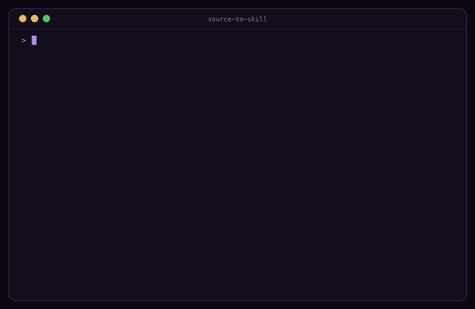

#  source-to-skill

One command to turn YouTube videos, playlists, papers, books, web articles, and GitHub repos into agent skills.

[](LICENSE)
[](pyproject.toml)
[](https://github.com/agentskills/agentskills)
[](#supported-sources)

<p align="center">
  
</p>

Point it at a source and your coding agent (Claude Code, GitHub Copilot CLI, Amp — any [Agent Skills](https://github.com/agentskills/agentskills) host) distills it into a structured AI agent skill it loads on demand. Video answers deep-link back to the exact `&t=` timestamp, YouTube playlists become course skills with one linked lesson per video, academic papers (arXiv or PDF) keep their methods/findings/limitations structure, books (EPUB) keep their chapters, web articles boil down to thesis and key claims, and GitHub repositories turn their README and docs into a library guide. Everything runs locally through your own agent — no API keys, no cloud.

## Quick start

```bash
git clone https://github.com/michalstrnadel/source-to-skill ~/.claude/skills/source-to-skill
pip install yt-dlp PyMuPDF   # only what your sources need; EPUB, articles, and repos need neither
```

1. In Claude Code: `/source-to-skill https://www.youtube.com/watch?v=...`
2. The agent extracts the source, shows a token estimate, and asks where to install the generated skill.
3. Ask `/your-video-slug <question>` — the answer cites the transcript and links the exact second of the video.

The same one-liner covers every source type:

```bash
/source-to-skill https://www.youtube.com/playlist?list=PL...   # playlist -> course skill
/source-to-skill https://example.com/that-great-blogpost       # article -> claims + highlights
/source-to-skill https://github.com/pallets/flask              # repo docs -> library skill
```

From a two-hour lecture you get something like:

```
attention-explained/
├── SKILL.md              # core ideas + timestamped segment index
├── segments/
│   ├── 01-intro.md       # one per video chapter, loaded on demand,
│   ├── 02-self-attention.md   #   each opening with its &t= deep link
│   └── ...
└── cheatsheet.md         # actionable steps and decision rules
```

Papers and books work the same way — `/source-to-skill https://arxiv.org/abs/1706.03762` yields `methods.md` / `findings.md` / `limitations.md` / `glossary.md` / `citations.md`; `/source-to-skill book.epub` yields a chapter index with on-demand chapter files.

## Features

- **YouTube video → skill** — captions via yt-dlp (manual preferred, auto fallback, any language), segmented by the video's own chapters; every segment file deep-links back with `&t=`.
- **YouTube playlist → course skill** — the whole playlist becomes a course: lesson index, one lesson file per video opening with a link to that video, one cheatsheet across the course. Captionless videos are skipped with a warning, never fatal.
- **Paper → skill** — PyMuPDF extraction with academic section detection; arXiv URLs download automatically.
- **Book → skill** — EPUB parsing with the Python standard library alone; PDF books via `--type book` take chapters from the document outline.
- **Web article → skill** — readable-article extraction with the standard library alone (prefers `<article>`, drops nav/footer/script chrome); any blogpost URL becomes thesis, key claims, and quotable highlights.
- **GitHub repo → skill** — README and `docs/` pulled via one tarball download, no git clone; the repo's documentation becomes a library skill with install steps, usage patterns, and a command cheatsheet.
- **Deterministic extractor, agent generator** — Python normalizes every source to one text + metadata contract; your agent does the distillation following `SKILL.md`. Skills are structure (frameworks, decision rules, concrete numbers), not summaries.
- **Cheap to query** — the generated `SKILL.md` stays around 4k tokens; segment, lesson, chapter, and findings files load only when a question needs them.

## Supported sources

| Source | Command | What your agent gets |
|--------|---------|----------------------|
| YouTube video | `/source-to-skill https://youtube.com/watch?v=...` | chapter-segmented skill, every answer deep-links the exact `&t=` second |
| YouTube playlist / course | `/source-to-skill https://youtube.com/playlist?list=...` | course skill: lesson index, one linked lesson per video, course-wide cheatsheet |
| Academic paper (arXiv, PDF) | `/source-to-skill https://arxiv.org/abs/1706.03762` | TL;DR and key claims plus methods, findings, limitations, glossary, citations |
| Book (EPUB, PDF) | `/source-to-skill book.epub` (PDF books: `--type book`) | chapter index with on-demand chapter files, glossary, cheatsheet |
| Web article / blogpost | `/source-to-skill https://example.com/post` | thesis and key claims linked to the original, quotable highlights |
| GitHub repository | `/source-to-skill https://github.com/pallets/flask` | library skill: install, core usage patterns, per-area guides, command cheatsheet |

## Requirements

- Python ≥ 3.10
- `yt-dlp` for YouTube videos and playlists, `PyMuPDF` for PDFs — install only what you use; EPUB books, web articles, and GitHub repos need only the standard library
- Videos need captions (manual or auto-generated); audio transcription is on the roadmap. In a playlist, captionless videos are skipped rather than failing the run
- Scanned PDFs without a text layer are not supported (OCR is on the roadmap)

Check your setup anytime:

```bash
python3 scripts/extract.py --check
```

## Install for other agents

Clone into the skills folder your agent reads:

```
~/.claude/skills/    # Claude Code
~/.copilot/skills/   # GitHub Copilot CLI
~/.agents/skills/    # Amp / cross-agent
```

Project-local `.claude/skills/`, `.agents/skills/`, or `.github/skills/` work too.

## How it works

`scripts/extract.py` detects the source type (YouTube video or playlist URL, arXiv URL, GitHub repository URL, any other web URL as an article, local PDF or EPUB — with an optional `--type` override), parses it with the matching parser, and writes normalized `full_text.txt` + `metadata.json` to a work directory. Your agent then follows the repo-root `SKILL.md`: it confirms the token cost with you, distills the text through the template for that source type, installs the skill where you choose, and validates the result with `tools/validate_skill.py`. Details in [docs/ARCHITECTURE.md](docs/ARCHITECTURE.md).

## Troubleshooting

- **"No captions available"** — the video has no manual or auto captions; transcription isn't supported yet.
- **"skipping [NN] ..." warnings on a playlist** — videos without captions are skipped and listed under `skipped` in `metadata.json`; the playlist fails only when no video has captions.
- **"Couldn't extract a readable article"** — the page renders its text with JavaScript or requires a login; save it as a PDF and pass the file, or try another URL.
- **"GitHub returned 404"** — the repository does not exist or is private; check the URL — private repos are not supported.
- **A `watch?v=...&list=...` link extracted a single video** — that is the default; pass `--type playlist` to extract the whole playlist.
- **"no usable text layer (scanned PDF?)"** — the PDF is image-only; run it through OCR first.
- **"Missing dependency"** — run `python3 scripts/extract.py --check` and install what it suggests.
- **A PDF book parsed as a paper** — PDFs default to the paper parser; pass `--type book` to use the book parser with outline chapters.
- **Wrong chapters on a PDF book** — the PDF has no outline; the parser falls back to heading detection, then full text.

## License

[MIT](LICENSE)
